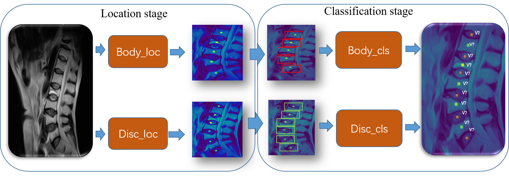
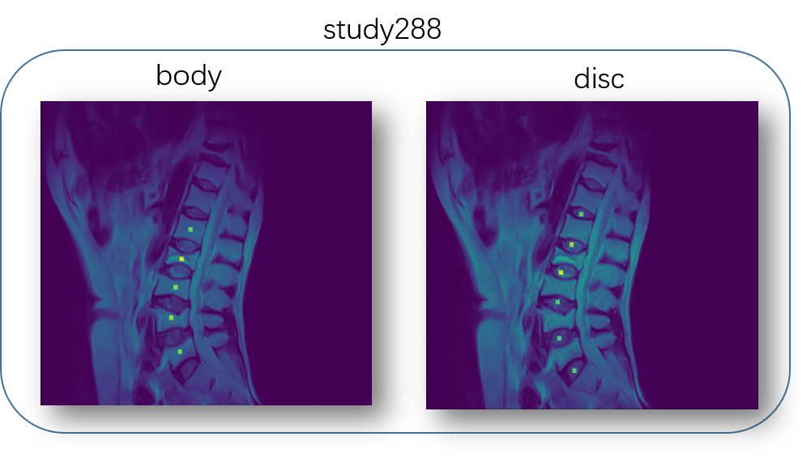
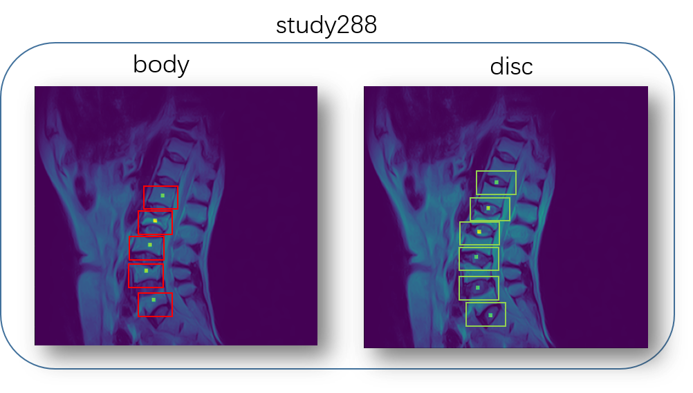
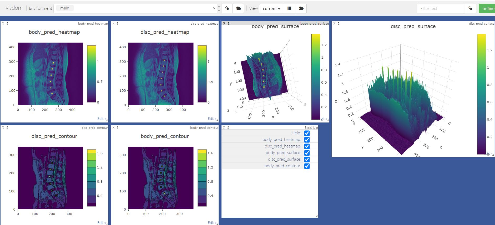

# PyDoctor
A general python framework for medical image processing and intelligent medical diagnostic, based on **PyTorch**.

#### 0:    Overview of our method
Here is our pipeline:

#### 1:    Install dependencies
Run the installation script to install all the dependencies. You need to provide the conda install path (e.g. ~/anaconda3) and the name for the created conda environment (here ```pydoctor```).  
```bash
bash install.sh conda_install_path pydoctor
```  
This script will also download packages and set-up the environment. 

**Note:** The install script has been tested on an Ubuntu18.04/Ubuntu16.04 system. In case of issues, check the [detailed installation instructions](INSTALL.md)

**Windows:** (NOT Recommend!) Coming in future. Check [these installation instructions](INSTALL_win.md)


#### 2: Please arrange your dataset like this:
- Put your data in ```PyDoctor/data/``` in this tree.
```angular2
--data
    --DatasetA
            --lumbar_train150
                    study10
                    study100
                    ...
            --lumbar_train51
                    study0
                    study1
                    ...
            --lumbar_testA50
                    study201
                    study202
                    ...
            lumbar_train51_annotation.json
            lumbar_train150_annotation.json
    --DatasetB
            --lumbar_testB50
                    study251
                    study252
                    ...
            testB50_series_map.json
``` 
#### 3: Clean the testB and testA dataset before testing.
We separate this part from main function for clear. What you need to do is run the python scripts in PyDoctor/pydoctor/data_clean/

clear the testB
 ```bash
cd clean_for_testB
python clean_step_1.py
python clean_step_2.py

```
clear the testA
 ```bash
cd clean_for_testA
python clean_step_1.py
python clean_step_2.py
python clean_step_3.py
python clean_step_4.py
python clean_step_5.py
```
           


#### 4:   You can test our models without training.

- Download the trained networks from the [baidu drive folder](https://pan.baidu.com/s/1BZsejKvr_a0ASJZh2P0f9g ) 提取码：`h6ey`. 
- Put the *.pth files into **PyDoctor/pydoctor/networks/** .
- Set the dataset path in ```pydoctor/ltr/admin/local.py``` (If local.py is absence, please check in installation instructions to run **Setup the environment**)

Activate the conda environment and run the script pydoctor/run_doctor.py on dataB.
```bash
conda activate pydoctor
cd pydoctor
python run_doctor 

```

#### 5: You also can train our pydoctor from scratch.
- **PyDoctor** introduce a diagnose architecture consisting of two components designed exclusively for target location and target classification.
- Target location: We decomposed location-stage with body_loc(vertebral body) and disc_loc(intervertebral disc).Here are our PyDoctor location result on testB.See more images here [body_loc](pydoctor/.figs/body_loc) & [disc_loc](pydoctor/.figs/disc_loc)
- Target classification: We also decomposed classification-stage with body_cls and disc_cls. After obtaining the locations of body or disc, we crop patches from images and resize into fixed scale.
- After data argement
##### location figure (testB/study288)

##### classfication figure (testB/study288)


##### Train model in ```PyDoctor/ltr/```
    1:  Before train please check your data path in ltr/admin/local.py(Absolute path is better than relative path if any error occur.)
    2:  Activate pydoctor with :conda activate pydoctor
    3:  cd  'PyDoctor/ltr'
    4:  python run_training_body_cls.py  # this will run 20  epoch, we used the 4   epoch
    5:  python run_training_body_loc.py  # this will run 100 epoch, we used the 100 epoch 
    6:  python run_training_disc_cls.py  # this will run 20  epoch, we used the 4   epoch
    7:  python run_training_disc_loc.py  # this will run 100 epoch, we used the 100 epoch 
    8:  Go ltr/workspace/   check tensorboard and select the minimize lumbar_val loss epoch . 
    9:  Select the suitable pth file  and set the path in PyDoctor/pydoctor/doctorning/verson_1.py which I have give you a e.g.
    10: You can run pydoctor/run_doctor.py and get the reuslt you want .
    
#### Visualize for Show result (default is off ).If you want to show the result,turn it on .
1: Open another terminal 
```angular2
conda activate pydoctor
visdom
open ``localhost:8097`` with any explorer(IE or chrome or any)
```
```bash

cd pydoctor
python run_doctor --use_visdom True

```


#### What's next?

#### [pydoctor](pydoctor) - for implementing your doctor

#### [ltr](ltr) - for training your doctor


### Information about Author

* [王宁](https://space.bilibili.com/9456738):从事计算机视觉，视频分析等相关研究。如果代码运行遇到任何问题，请与我联系。


王宁：DingDing:```g7f-k259gwe4v```  E-mail:```1098069058@qq.com```


